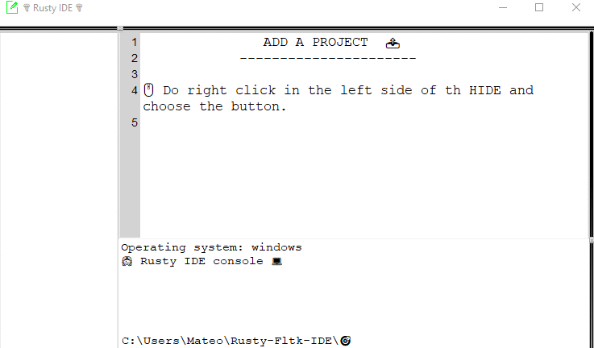
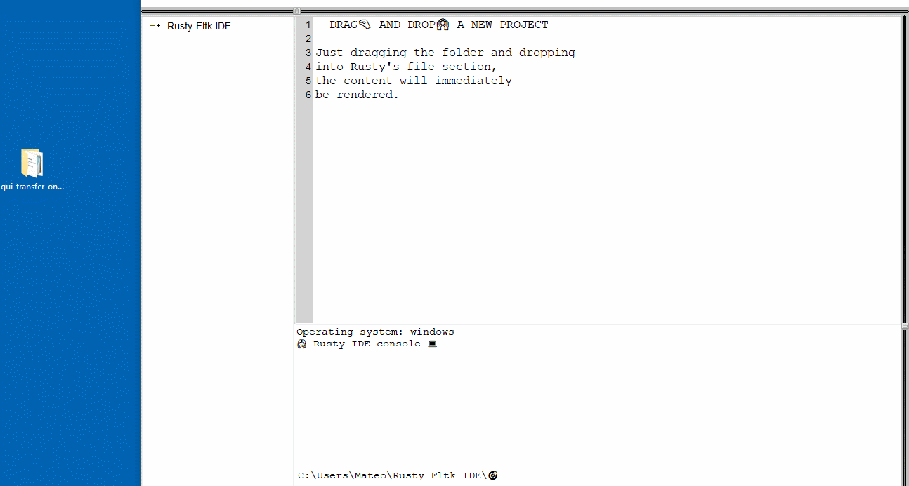
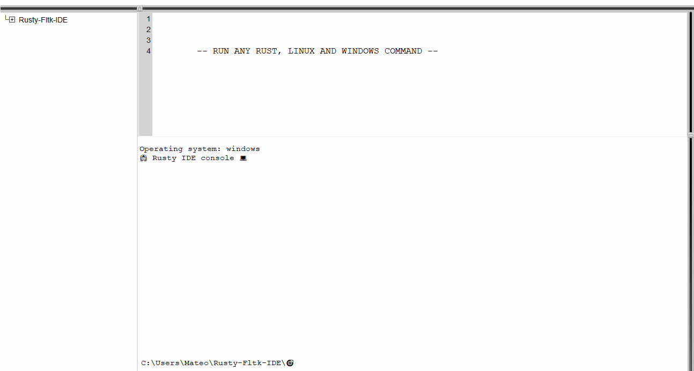

  

  ---

<h2>⚠️Still in development⚠️</h2>

  <h1>🪂Rusty IDE🪂</h1>
  
A lightweight IDE based on rust

 

🪂Rusty is a lightweight and fast IDE developed in Rust, focused on Rust and web3 technology development. With its simple and elegant graphical interface‍, you can enhance productivity in your projects and enjoy a smooth coding experience. Designed with performance in mind, Rusty provides a fast and efficient code editing experience, allowing developers to focus on creating innovative solutions in Rust and web3 technology. If you're looking for an intuitive and user-friendly tool for your Rust programming projects, give Rusty a try today!

---

Add a project into the IDE 💼

 

 

The Rusty fltk IDE is an integrated development environment specifically designed for the Rust programming language. It utilizes the FLTK library for the graphical interface. It provides a range of features and functionalities to facilitate project development and repository management.

The provided code shows a function called [btn_add_folder](https://github.com/mateolafalce/RustyFltkIDE/blob/main/src/functions/folders_functions/btn_add_folder.rs) that creates a button in the IDE's interface. Clicking on this button will open a native dialog box to select a folder representing a project or repository.

Once a folder is selected, a series of actions are performed. The selected folder path is obtained and checked for validity. If a valid path is provided, a label is displayed in the options window indicating that it is loading.

Next, the [set_folders_roots()](https://github.com/mateolafalce/RustyFltkIDE/blob/main/src/functions/root/set_folders_roots.rs) function is called to set the root folder paths for the project. If successful, the [render_folder()](https://github.com/mateolafalce/RustyFltkIDE/blob/main/src/functions/folders_functions/render_folder.rs) function is invoked to render the project's folder structure as a visual tree within the IDE.

In case any errors occur during the process, an alert with the corresponding error message is displayed.

Additionally, the button has an event handling mechanism that changes the cursor when the mouse enters or exits the button's area.

---

Add a project by drag🤏 and drop 🙌

 

The [render_folder()](https://github.com/mateolafalce/RustyFltkIDE/blob/main/src/functions/folders_functions/render_folder.rs) function is responsible for rendering a folder's contents. It takes as input an FLTK App object, a Tree widget representing the folder structure, and a TextBuffer for displaying file contents. The function begins by initializing some variables, including prefix and close_tree, which are used to keep track of the folder structure and determine which folders to close. It retrieves the root paths of the folders from an external module called get_folders_roots.

Next, it iterates over the root paths and performs the following steps for each path:

- Extracts the parent directory of the current path and adds it to the close_tree vector.
- Appends the parent directory to the prefix vector.
- Calls the get_all_paths_in_directory function from the get_all_paths_in_directory module, passing the current path, the parent directory, and a boolean indicating whether the repository is clear.
- Filters out any paths that contain "target".
- Adds the remaining paths to the folders tree widget.
- After populating the tree widget, the function closes the folders specified in the close_tree vector. It then checks the length of the prefix vector to determine how many folders to render.

If there is only one prefix, it calls the render_file function from the render_file module once, passing the folders, text_buffer, and the sole prefix. If there are multiple prefixes, it iterates over all but the last prefix and calls render_file for each one, passing the corresponding prefix along with the folders and text_buffer.

Finally, the function triggers a redraw of the FLTK application.

In the main function, the render_folder function is called before the FLTK event loop starts. It is passed the necessary arguments, including the App object, the folders tree widget, and the text_buffer. This ensures that the folder contents are rendered initially when the application is launched. Overall, the render_folder function plays a crucial role in displaying the folder structure and file contents in the FLTK-based application, and it is called during the initialization process in the main function.

 

---

Run a Rust, Linux or Windows command 👨‍💻

 

The [run_a_command()](https://github.com/mateolafalce/RustyFltkIDE/blob/main/src/functions/run_a_command.rs) function is the main function responsible for executing the commands entered by the user in the integrated terminal. Here's a summary of the processes that occur behind the scenes:

- A command is received as input parameter in string format **input**.
- A copy of the input command is created without the root directory path prefix **root**.
- The root directory path is obtained and manipulated to remove the last two characters, which correspond to the current file path.
- The operating system **OS** is checked to determine if it's "Windows".
- If the operating system is Windows, the [commands_for_windows()](https://github.com/mateolafalce/RustyFltkIDE/blob/main/src/functions/specific_commands/commands_for_windows.rs) function is called to process Windows-specific commands. This function performs actions such as directory navigation, directory listing, clearing the screen, etc.
- The [commands_for_cargo()](https://github.com/mateolafalce/RustyFltkIDE/blob/main/src/functions/specific_commands/commands_for_cargo.rs) function is called to process cargo-specific commands. This function handles commands related to building, running, and managing cargo projects. The commands are analyzed, and the corresponding function is executed based on the entered command.
- A successful result **Ok(())** is returned if all processes are executed correctly.
the run_a_command function takes the input command, removes the root directory path prefix, checks the operating system, and then calls the appropriate functions to process Windows-specific and cargo commands. This allows executing the commands entered by the user in the rusty IDE's integrated terminal.

 

---

Apache2.0 📜

 

This project is licensed under the Apache License, Version 2.0 (the "License"). You may not use this file except in compliance with the License. You may obtain a copy of the License at:

http://www.apache.org/licenses/LICENSE-2.0

Unless required by applicable law or agreed to in writing, software distributed under the License is distributed on an "AS IS" BASIS, WITHOUT WARRANTIES OR CONDITIONS OF ANY KIND, either express or implied. See the License for the specific language governing permissions and limitations under the License.

